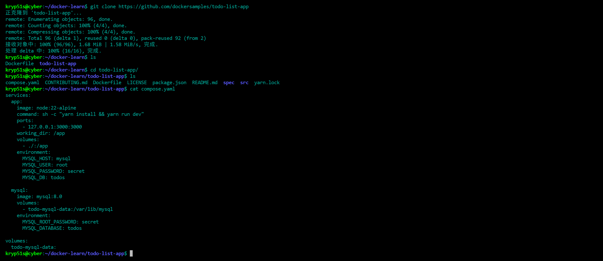

Welcome to [Hexo](https://hexo.io/)! This is your very first post. Check [documentation](https://hexo.io/docs/) for more info. If you get any problems when using Hexo, you can find the answer in [troubleshooting](https://hexo.io/docs/troubleshooting.html) or you can ask me on [GitHub](https://github.com/hexojs/hexo/issues).

## Quick Start

### Create a new post

``` bash
$ hexo new "My New Post"
```

More info: [Writing](https://hexo.io/docs/writing.html)

### Run server

``` bash
$ hexo server
```

More info: [Server](https://hexo.io/docs/server.html)

### Generate static files

``` bash
$ hexo generate
```

More info: [Generating](https://hexo.io/docs/generating.html)

### Deploy to remote sites

``` bash
$ hexo deploy
```

More info: [Deployment](https://hexo.io/docs/one-command-deployment.html)


```shell
kryp51s@cyber:~/docker-learn$ git clone https://github.com/dockersamples/todo-list-app
正克隆到 'todo-list-app'...
remote: Enumerating objects: 96, done.
remote: Counting objects: 100% (4/4), done.
remote: Compressing objects: 100% (4/4), done.
remote: Total 96 (delta 1), reused 0 (delta 0), pack-reused 92 (from 2)
接收对象中: 100% (96/96), 1.68 MiB | 1.58 MiB/s, 完成.
处理 delta 中: 100% (16/16), 完成.
kryp51s@cyber:~/docker-learn$ ls
Dockerfile  todo-list-app
kryp51s@cyber:~/docker-learn$ cd todo-list-app/
kryp51s@cyber:~/docker-learn/todo-list-app$ ls
compose.yaml  CONTRIBUTING.md  Dockerfile  LICENSE  package.json  README.md  spec  src  yarn.lock
kryp51s@cyber:~/docker-learn/todo-list-app$ cat compose.yaml 
services:
  app:
    image: node:22-alpine
    command: sh -c "yarn install && yarn run dev"
    ports:
      - 127.0.0.1:3000:3000
    working_dir: /app
    volumes:
      - ./:/app
    environment:
      MYSQL_HOST: mysql
      MYSQL_USER: root
      MYSQL_PASSWORD: secret
      MYSQL_DB: todos

  mysql:
    image: mysql:8.0
    volumes:
      - todo-mysql-data:/var/lib/mysql
    environment:
      MYSQL_ROOT_PASSWORD: secret
      MYSQL_DATABASE: todos

volumes:
  todo-mysql-data:
kryp51s@cyber:~/docker-learn/todo-list-app$ 
```



